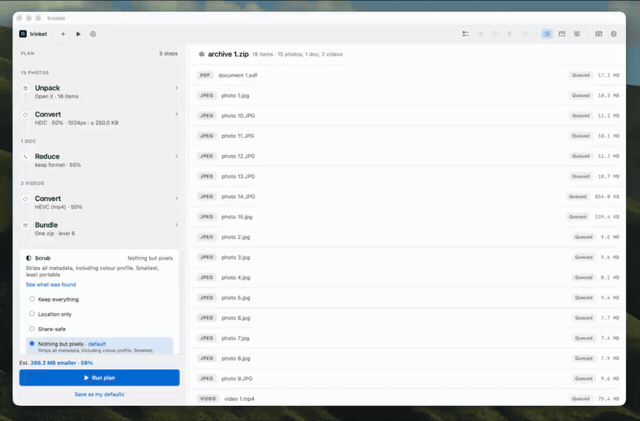

<p align="center">
  
</p>

<h1 align="center">trinket</h1>

<p align="center">
  Offline file conversion, compression and metadata scrubbing for macOS. Drop files in and<br>
  trinket proposes a plan — smaller, a friendlier format, and safe to send.
</p>

<p align="center">
  <a href="https://github.com/smrazar/trinket/releases/latest">Download</a> ·
  <a href="docs/STATUS.md">Status</a> ·
  <a href="docs/CHANGELOG.md">Changelog</a> ·
  <a href="docs/BUGS.md">Bugs</a> ·
  <a href="docs/ARCHITECTURE.md">Architecture</a> ·
  <a href="docs/ROADMAP.md">Roadmap</a>
</p>

Swift + SwiftUI + AppKit, Swift Package Manager, no Xcode project. macOS 15+. Ad-hoc signed —
see [Install](#install).

**Current version: 1.0**, a complete rewrite. Release notes are in
[`CHANGELOG.md`](docs/CHANGELOG.md); every bug ever fixed, with its root cause and the check that
pins it, is in [`BUGS.md`](docs/BUGS.md).

**Everything runs on your Mac.** No file is ever uploaded — not for conversion, not for updates,
not for anything. Conversion, compression and scrubbing are entirely local.

**One exception, stated plainly:** the metadata inspector draws a map of where a photo was taken,
and `MKMapSnapshotter` fetches those map tiles from Apple. So opening that panel sends *that
photo's coordinates* — never the photo — off the machine. Nothing else in the app touches the
network. If that matters to you, the coordinates are listed in text right above the map, and the
scrub removes them whether you look at the map or not.

---

## Watch it work



A mixed archive — photos, a document and a video — opened, planned, renamed and run. Three times
actual speed, no cuts.

<sup>[The full clip at full speed and full resolution](https://smrazar.github.io/trinket/#features),
on the site. GitHub only plays video it hosts itself, so this one is a GIF.</sup>

---

## The idea

**The app proposes a plan.** Files land, trinket reads them, works out what it would do, and shows
you the whole path at once — open the archive, shrink the photos, convert the video, pack it back
up — with every decision already answered. Change what you like. Press one button.

```
Unpack  ›  Reduce · 75% · 1024px  ›  Bundle · zip          Scrub: Nothing but pixels
```

The left sidebar *is* that plan: one section per stage, in the order chosen for your files, each
collapsed to a single line stating its decision and expandable to change it. Stages that do not
apply are absent rather than greyed out, and when something cannot be done the row says so in
words instead of showing a progress bar that never moves.

## What it does

### Shrinks

Photos, PDFs, audio and video. Measured on real files: a 4000×3000 photo to 122 KB, a 230 MB video
down 43%, a 23-page PDF down 30%.

For images it is **one ImageIO pass** that resizes, re-encodes and scrubs together — never two,
because two passes means decoding and losing quality twice. Set a target size and it binary-searches
the quality down until the file fits. Quality is also nudged per image automatically: a screenshot
and a photograph do not want the same setting, and the flat areas in a screenshot are exactly where
JPEG ringing shows.

### Converts

The HEIC nobody else can open becomes a JPEG everybody can. Only image formats are ever offered for
an image — the type system enforces that, so no menu ever suggests "Word (docx)" for a PNG.

### Scrubs metadata — and shows you first

Photos carry more than they look like they carry: GPS coordinates, the camera's serial number, the
lens, the software, sometimes the name of the machine that edited them. A cropped photo can keep a
thumbnail of the **uncropped** original — so cropping someone out and sharing it leaks them anyway.

trinket shows what it found *before* removing anything, with the value itself where showing it is
the point: the coordinates on a map, the serial, and the hidden thumbnail beside the picture you
think you are sharing.

| Level | Removes |
|---|---|
| Keep everything | nothing |
| Location only | GPS |
| Share-safe | GPS, camera identity, edit history, hidden thumbnails, software — keeps date, byline and colour |
| **Nothing but pixels** | all of the above, plus the colour profile |

Nothing but pixels converts the image to sRGB **before** dropping the profile, so the colours still
mean what they meant. Orientation is baked into the pixels the same way, so a portrait photo does
not come out sideways.

The scrub builds a fresh list of what survives rather than deleting the fields it knows about —
otherwise every block nobody thought of, maker notes and XMP packets included, rides along
untouched.

### "I zipped my photos and it got bigger"

Because JPEG, MP4 and PDF have no redundancy left to squeeze. Zipping them adds container overhead:
one 145.3 MB folder of photos came out at 146.7 MB, slowly. Compressing harder only makes it slower.

The answer is a different verb — **shrink what is inside**. trinket opens the archive, re-encodes
the contents and packs it back up. Same photos: 73.8 MB. An archive in, an archive out; loose files
in, loose files out.

### Renames, if you want

Batch renaming with three modes: find & replace (regular expressions, case sensitivity, match-all,
name or extension), add text before or after, and a token template — `{name}`, `{n}`, `{date}`,
`{w}×{h}`, `{parent}`. Every mode shows a live **Original → Renamed** table built by the same code
that does the renaming, so what you see is what you get. Off by default.

## Formats

**Images** — reads 62 formats including every common RAW; writes JPEG, PNG, HEIC and TIFF.

**Documents** — PDF, rebuilt page by page, which also collapses the revision history where earlier
"deleted" text hides.

**Audio** — AAC, MP3, FLAC, Apple Lossless, WAV, AIFF, Opus, Ogg Vorbis.

**Video** — H.264, HEVC, VP9/WebM.

**Archives** — reads zip, tar, 7z, xz, bz2, cpio and more; writes zip. RAR is deliberately absent:
unrar's licence does not permit redistribution, so claiming it would be a lie the first time you
dropped one.

## Install

Requires macOS 15 or later, Apple Silicon.

```bash
git clone https://github.com/smrazar/trinket.git
cd trinket
./install.sh
```

That builds the app, installs it to `/Applications` and launches it. There is no notarised
download: the app is ad-hoc signed, so macOS will not run it from a zip without complaint. Building
from source takes about a minute and is the supported path.

## Checks

There is no test target — this project builds with Swift Package Manager and Command Line Tools, so
the checks ship **inside the binary**:

```bash
trinket --self-check
```

Two suites run. The first checks each piece on its own: colour contrast, byte formatting, the
planner, the renamer, and each engine against probe files it generates itself. The second pushes
real files all the way through analyse → plan → run and asserts on the bytes that land — sizes
fell, GPS gone, hidden thumbnail gone, every archive entry still present, loose files still loose.

`package-app.sh` runs it, so **a failing check fails the build**. A check that stops being true
cannot ship. The assertions state *why*, not just what, so a change that quietly reverses a
decision fails with the reason attached.

## Licence

**GPL-3.0-or-later.**

trinket bundles [ffmpeg](https://ffmpeg.org), built with `--enable-gpl --enable-version3`, which is
GPL-3.0-or-later, and that licence propagates. `Resources/ffmpeg-BUILD.txt` records the exact
upstream build and its full configure line, so the corresponding-source offer is answerable.
